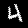
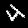

# Are CNNs Rotation-Invariant? A Controlled Experiment with MNIST
By Lászlo Roovers - June 2025 - https://github.com/LaszloRooversUni/rotated_mnist
## Introduction

Convolutional Neural Networks (CNNs) have become the standard architecture for many image recognition tasks, largely due to their ability to learn local spatial features and exhibit translation invariance. However, an often-overlooked question is whether CNNs can generalize to rotated inputs, a common transformation in real-world applications such as medical imaging, satellite imagery, and autonomous driving.

Despite their widespread use, standard CNNs are not inherently rotation-invariant. This has been discussed in various studies, including Cohen & Welling’s Group Equivariant CNNs [1], which introduce architectures explicitly designed to handle symmetry transformations, and Esteves et al.'s Polar Transformer Networks [2], which explore rotation-equivariant representations.

In this blog post, we construct a simple, controlled experiment to test rotation invariance by evaluating a CNN trained on unrotated MNIST digits against test sets rotated by 30°, 60°, and 90°. The results reveal clear limitations of standard CNNs and provide motivation for more robust architectures.

## Property Under Test: Rotation Invariance

Rotation invariance refers to a model’s ability to produce consistent predictions even when the input image is rotated. Ideally, if a digit "3" is rotated by 30°, the model should still recognize it as a "3".

This property matters because in deployment scenarios, models often encounter data that may differ in orientation from the training distribution. A lack of rotation invariance can lead to significant performance drops and misclassifications, making models brittle and less trustworthy.

## Designing the Control Dataset

To isolate the effect of rotation, we created a control dataset by rotating the test set of MNIST digits while keeping the training set unchanged. Specifically, we generate rotated test sets at three fixed angles: 30°, 60°, and 90°.

This setup allows us to directly observe the model’s performance degradation as a function of rotation angle, without confounding variables.

The dataset was generated using the following script:

```python
from torchvision.datasets import MNIST
from torchvision import transforms
from PIL import Image
import os

rotation_angles = [30, 60, 90]

project_root = os.path.dirname(os.path.dirname(os.path.abspath(__file__)))
output_dir = os.path.join(project_root, "data")


def rotate_and_save() -> None:
    """Rotates MNIST images by specified angles and saves them in a structured directory."""
    dataset = MNIST(root="./", train=False, download=True)

    for angle in rotation_angles:
        angle_dir = os.path.join(output_dir, f"rotated_{angle}")
        os.makedirs(angle_dir, exist_ok=True)

        for i in range(len(dataset)):
            img, label = dataset[i]
            rotated_img = img.rotate(angle)
            label_dir = os.path.join(angle_dir, str(label))
            os.makedirs(label_dir, exist_ok=True)
            rotated_img.save(os.path.join(label_dir, f"{i}.png"))


if __name__ == "__main__":
    print("Starting rotation and saving of MNIST images...")
    rotate_and_save()
    print("Rotation and saving completed.")
    print(f"Images saved in {output_dir} with rotation angles: {rotation_angles}")
    print("You can now use these images for training or testing your models.")
```

This creates a labeled directory of rotated digits for each angle. The rotated digits retain their original labels, ensuring a clean and interpretable evaluation set.

## Example Images
To visualize the effect of rotation on the MNIST digits, we include side-by-side comparisons of the rotated images. This helps illustrate how the model's task becomes more challenging as the digits are rotated further from their upright orientation.

Below are example digits rotated by 30°, 60°, and 90°, respectively:
    


These rotations were applied uniformly to all test samples in the control dataset. As rotation increases, some digits (like 6/9 or 1/7) become harder to distinguish, revealing challenges for rotation-sensitive models.

## Experiment Setup

Model: We used a simple CNN with two convolutional layers followed by fully connected layers.

```python
import torch.nn as nn
import torch.nn.functional as F


class SimpleCNN(nn.Module):
    """A simple Convolutional Neural Network (CNN) for image classification.
    This model consists of two convolutional layers followed by two fully connected layers.
    It is designed to work with grayscale images of size 28x28, such as those
    found in the MNIST dataset.
    """

    def __init__(self):
        """Initializes the SimpleCNN model."""
        super().__init__()
        self.conv1 = nn.Conv2d(1, 32, 3, padding=1)
        self.conv2 = nn.Conv2d(32, 64, 3, padding=1)
        self.pool = nn.MaxPool2d(2)
        self.fc1 = nn.Linear(64 * 7 * 7, 128)
        self.fc2 = nn.Linear(128, 10)

    def forward(self, x):
        """Defines the forward pass of the model."""
        x = self.pool(F.relu(self.conv1(x)))
        x = self.pool(F.relu(self.conv2(x)))
        x = x.view(-1, 64 * 7 * 7)
        x = F.relu(self.fc1(x))
        x = self.fc2(x)
        return x
```

Training: The model is trained on the standard MNIST training set for 5 epochs using cross-entropy loss and Adam optimizer.

Evaluation:

- Test Set A: Standard unrotated MNIST test set
- Test Set B: Rotated MNIST at 30°
- Test Set C: Rotated MNIST at 60°
- Test Set D: Rotated MNIST at 90°

## Results

The table below shows the test accuracy across the different test sets:

| Angle (degrees) | Test Accuracy (%) |
| --------------- | ----------------- |
| 0 (original)    | 98.94             |
| 30              | 85.29             |
| 60              | 30.91             |
| 90              | 13.71             |

As expected, the performance degrades significantly as the rotation angle increases. This demonstrates that while CNNs are translation-invariant, they are not robust to rotation without explicit design changes or data augmentation.

## Conclusion

This experiment shows that standard CNNs, though powerful, struggle with rotated inputs. Rotation invariance is not an inherent property of CNNs, and relying solely on architectural design without augmentation or transformation-aware layers can result in fragile models.

This motivates the exploration of more robust techniques, including:

- Group-equivariant CNNs (Cohen & Welling, 2016)
- Capsule networks (Sabour et al., 2017)
- Transformer-based vision models that learn attention over spatial positions

While MNIST is a simple dataset, this controlled setup provides a clean benchmark for studying rotation invariance and can be extended to more complex datasets like CIFAR-10 or ImageNet.

## References

[1] Cohen, T.S., & Welling, M. (2016). Group Equivariant Convolutional Networks. ICML. https://arxiv.org/abs/1602.07576
[2] Esteves, C. et al. (2018). Polar Transformer Networks. ICLR. https://arxiv.org/abs/1709.01889

## Disclaimer on Generative AI Usage
Code completion was **assisted** by GitHub Copilot and the layout/documentation (documentation as in mainly distilling the information into a minimal yet functional README) by OpenAI ChatGPT.
